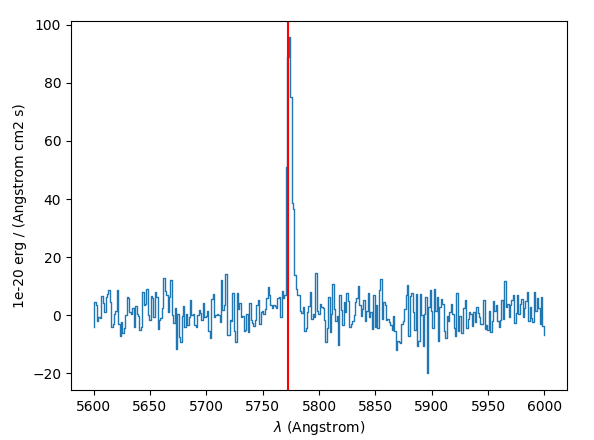
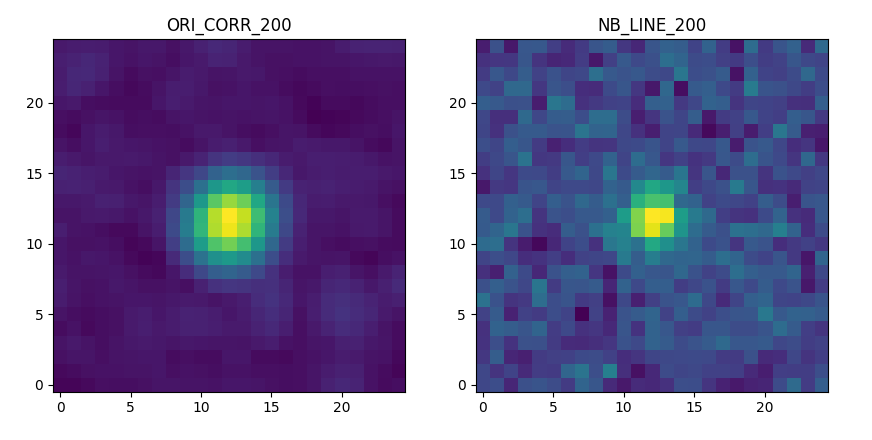

Usage
=====

Recommendation
--------------

The ORIGIN algorithm is computationally intensive, hence it is divided in
steps.  It is possible to save the outputs after each step and to reload
a session to continue the processing.

The software has been originally developed for the MUSE Hubble Ultra-Deep Field
(`Bacon et al, 2017
<https://www.aanda.org/articles/aa/pdf/2017/12/aa30833-17.pdf>`_).  Although it
was extensively tested on these deep datacubes, the blind use of the software is
not recommended and the user is advice to run each step, check carefully the
results and play with the input parameters until satisfactory results are
obtained.

The quality of the input cube is key to obtain the maximum
detections and to limit the false detections. The algorithm
is able to learn from the datacube itself its noise properties
and to adapt the threshold and other parameters. However
it has not been tested with strong non-gaussian noise or
large systematics.

The ORIGIN class
----------------

To run ORIGIN everything can be done through the `~muse_origin.ORIGIN` object.
To instantiate this object, we need to pass it a MUSE datacube. Here for the
example we will use the MUSE cube stored in the ``muse_origin`` package, which
is also used for the unit tests::

    >>> import muse_origin
    >>> import os
    >>> origdir = os.path.dirname(muse_origin.__file__)
    >>> CUBE = os.path.join(origdir, '..', 'tests', 'minicube.fits')

This supposes that you use a full copy of the git repository, the tests are
not included in the Python package because the file is quite big.

We also must give it a ``name``, this is the "session" name which is used as
the directory name in which outputs will be saved (inside the current directory
by default, which can be overridden with the ``path`` argument)::

    >>> testpath = getfixture('tmpdir')
    >>> orig = muse_origin.ORIGIN(CUBE, name='origtest', loglevel='INFO', path=testpath)
    INFO : Step 00 - Initialization (ORIGIN ...)
    INFO : Read the Data Cube ...
    INFO : Compute FSFs from the datacube FITS header keywords
    INFO : mean FWHM of the FSFs = 3.32 pixels
    INFO : 00 Done

Then this object allows to run the steps, which is described in more details in
the example notebook. It is possible to know the status of the processing with
`~muse_origin.status`::

    >>> orig.status()
    - 01, preprocessing: NOTRUN
    - 02, areas: NOTRUN
    - 03, compute_PCA_threshold: NOTRUN
    - 04, compute_greedy_PCA: NOTRUN
    - 05, compute_TGLR: NOTRUN
    - 06, compute_purity_threshold: NOTRUN
    - 07, detection: NOTRUN
    - 08, compute_spectra: NOTRUN
    - 09, clean_results: NOTRUN
    - 10, create_masks: NOTRUN
    - 11, save_sources: NOTRUN

Inputs
------

Datacube
++++++++

The input datacube must follow the MUSE standards, with proper WCS information
and data and variance extensions.

When the SNR is too low at the edge of the field, it might be wise to
mask these regions or to truncate the datacube. These operations can be
easily done in MPDAF with the
`Cube Class <https://mpdaf.readthedocs.io/en/latest/api/mpdaf.obj.Cube.html#mpdaf.obj.Cube>`_.

FSF
+++

ORIGIN needs some information about the FSF (*Field Spread Function*),
including its dependency on the wavelength.  The FSF model can be read from the
cube with MPDAF's `FSF models`_ (`mpdaf.MUSE.FSFModel`) or it can be provided
as parameter. It is also possible to use a Fieldmap_ for the case of mosaics
where the FSF varies on the field.

By default ORIGIN supposes that the cube contains an FSF model that can be
read with MPDAF::

    >>> from mpdaf.MUSE import FSFModel
    >>> fsfmodel = FSFModel.read(CUBE)
    >>> fsfmodel
    <OldMoffatModel(model=MOFFAT1)>
    >>> fsfmodel.to_header().cards
    ('FSFMODE', 'MOFFAT1', 'Old model with a fixed beta')
    ('FSF00BET', 2.8, '')
    ('FSF00FWA', 0.869, '')
    ('FSF00FWB', -3.401e-05, '')

This model is used to get the FWHM for each wavelength plane, otherwise the
full list must be provides as parameter::

    >>> import numpy as np
    >>> fsfmodel.get_fwhm(np.array([5000, 7000, 9000]))
    array([0.69... , 0.63..., 0.56...])

.. note::

    Although ORIGIN would perform better with an accurate FSF model, it is not
    very sensitive to its exact shape. It is recommended to derive a FSF model
    with MPDAF's `FSF models`_ and to save it in the datacube.

Profiles
++++++++

For the spectral axis ORIGIN uses a dictionary of line profiles, which will be
used to compute the spectral correlation. The ORIGIN comes with two FITS files
containing profiles:

- ``Dico_3FWHM.fits``: contains 3 profiles with FWHM of 2, 6.7 and 12 pixels.
  This is the one used by default.
- ``Dico_FWHM_2_12.fits``: contains 20 profiles with FWHM between 2 and 12
  pixels.

.. note::

    The CPU time for the TGLR computation `~muse_origin.ComputeTGLR` is directly
    proportional to the number of profiles.

Session save and restore
------------------------

At any point it is possible to save the current state with
`~muse_origin.ORIGIN.write`::

    >>> orig.write()
    INFO : Writing...
    INFO : Current session saved in .../origtest

This uses the ``name`` of the object as output directory::

    >>> orig.name
    'origtest'

In this output directory, all the step outputs are saved, as well as a log file
(``{name}.log``) and a YAML file with all the parameters used in the various
steps (``{name}.yaml``).

A session can then be reloaded with `~muse_origin.ORIGIN.load`::

    >>> import muse_origin
    >>> orig = muse_origin.ORIGIN.load(os.path.join(testpath, 'origtest'))
    INFO : Step 00 - Initialization (ORIGIN ...)
    INFO : Read the Data Cube ...
    INFO : Compute FSFs from the datacube FITS header keywords
    INFO : mean FWHM of the FSFs = 3.32 pixels
    INFO : 00 Done

Another interesting point with the session feature is that saving the current
state will unload the data from the memory. When running the steps, various
data objects (cubes, images, tables) are added as attributes to the step
classes, and saving the session will dump these objects to disk and free the
memory.

Steps
-----

The steps are implemented are `~muse_origin.Step` sub-classes
(described below), which can be run with methods of the
`~muse_origin.ORIGIN` object:

- ``orig.step01_preprocessing``
- ``orig.step02_areas``
- ``orig.step03_compute_PCA_threshold``
- ``orig.step04_compute_greedy_PCA``
- ``orig.step05_compute_TGLR``
- ``orig.step06_compute_purity_threshold``
- ``orig.step07_detection``
- ``orig.step08_compute_spectra``
- ``orig.step09_clean_results``
- ``orig.step10_create_masks``
- ``orig.step11_save_sources``

Each step has several parameters, with default values.
The most important parameters are mentioned below, and more
details about the others parameters and attributes can be found in the
docstrings of the step classes.

Step 1: `~muse_origin.Preprocessing`
    Preparation of the data for the following steps:

    - Nuisance removal with DCT. The estimated continuum cube is stored in
      ``cube_dct``. The order of the DCT is set with the ``dct_order`` keyword.

    - Standardization of the data (stored in ``cube_std``).

    - Computation of the local maxima and minima of ``cube_std``.

    - Segmentation based on the continuum (``segmap_cont``), with the threshold
      defined by ``pfasegcont``.

    - Segmentation based on the residual image (``ima_std``), with the
      threshold defined by ``pfasegres``, merged with the previous one which
      gives ``segmap_merged``.

Step 2: `~muse_origin.CreateAreas`
    Creation of areas for the PCA.

    The purpose of spatial segmentation is to locate regions where the sky
    contains "nuisance" sources, i.e., sources with continuum and / or bright
    emission lines, or regions exhibiting a particular statistical behaviour,
    caused by the presence of systematic residuals for instance.

    The merged segmentation map computed previously is used to avoid cutting
    continuum objects. The size of the areas is controlled with the ``minsize``
    and ``maxsize`` keywords.

Step 3: `~muse_origin.ComputePCAThreshold`
    Loop on each area and estimate the threshold for the PCA, using the
    ``pfa_test`` parameter.

    This parameter is important. If it is too small, the PCA will not be
    efficient to remove the background residuals and the algorithm will
    fail to detect faint emitters. It if is too important, the risk is
    to remove the line emitters. Note that the algorithm is able to retrieve
    the brightest line emitters which have been removed by the PCA.

Step 4: `~muse_origin.ComputeGreedyPCA`
    Nuisance removal with iterative PCA.

    This is one of the most computationally intensive step in ORIGIN, with the
    following step.

    Loop on each area and compute the iterative PCA: iteratively locate and
    remove residual nuisance sources, i.e., any signal that is not the
    signature of a faint, spatially unresolved emission line.  Use by default
    the thresholds computed in step 3.

    Inspection of the map of the number of PCA iterations is instructive of
    the regions of low SNR and/or defects in the datacube.
    Depending of the datacube quality, the default value of the maximum number
    of iterations might be increase.

Step 5: `~muse_origin.ComputeTGLR`
    Compute the cube of GLR test values (the "correlation" cube).

    The test is done on the cube containing the faint signal (``cube_faint``)
    and it uses the PSF and the spectral profiles. Then computes the local
    maximum and minima of correlation values and stores the maxmap and minmap
    images. It is possible to use multiprocessing to parallelize the work (with
    ``n_jobs``), but the best is to use the c-level parallelization with the
    *mkl-fft* package.

    .. warning::

        Do not use both n_jobs and *mkl-fft*, this will result in too many
        threads and will slow down the computation.

Step 6: `~muse_origin.ComputePurityThreshold`
    Find the thresholds for the given purity, for the correlation (faint)
    cube and the complementary (std) one.

    .. tip::

        The purity computation can fail if the number of detections in
        the negative cube is always larger than in the positive
        datacube. If this happen, it is still psossible to continue
        to next step by fixing the threshold parameter. Inspection
        of the purity plot can help to find the correct threshold
        to avoid too many false detections.

Step 7: `~muse_origin.Detection`
    Detections on local maxima from the correlation and complementary cube,
    using the thresholds computed in step 5. It is also possible to provides
    thresholds with the corresponding parameters. This creates the ``Cat0``
    table.

    Then the detections are merged in sources, to create ``Cat1``. See
    :ref:`merging` below.

Step 8: `~muse_origin.ComputeSpectra`
    Compute the estimated emission line and the optimal coordinates.

    This computes ``Cat2`` with a refined position for sources.  And for each
    detected line in a spatio-spectral grid, the line is estimated with the
    deconvolution model::

        subcube = FSF*line -> line_est = subcube*fsf/(fsf^2))

    .. warning::

        The line flux value reported in the Cat2 table is buggy. To get correct
        flux value, it is recommended to extract them from the spectrum stored
        in the final source computation step.

Step 9: `~muse_origin.CleanResults`
    This step does several things to “clean” the results of ORIGIN:

    - Some lines are associated to the same source but are very near
      considering their z positions.  The lines are all marked as merged in
      the brightest line of the group (but are kept in the line table).
    - A table of unique sources is created.
    - Statistical detection info is added on the 2 resulting catalogs.

    This step produces two tables:

    - `Cat3_lines`: clean table of lines;
    - `Cat3_sources`: table of unique sources.

Step 10: `~muse_origin.CreateMasks`
    This step create a source mask and a sky mask for each source. These masks
    are computed as the combination of masks on the narrow band images of each
    line.

Step 11: `~muse_origin.SaveSources`
    Create an `mpdaf.sdetect.Source` file for each source.
    See :ref:`source` for detailed information of the source content.

.. _merging:

Merging of lines in sources
---------------------------

Once we get the list of line detections, we need to group these detections in
"sources", where a given source can have multiple lines. It's a tricky step
because extended sources can have detections with different spatial positions.
To solve this problem we use the information from a segmentation map, that can
be provided or computed automatically on the continuum image, to identify the
regions of bright or extended sources. And we adopt a different method for
detections that are in these areas.

First, the detections are merged based on a spatial distance criteria (the
``tol_spat`` parameter). Starting from a given detection, the detections within
a distance of ``tol_spat`` are merged. Then looking iteratively at the
neighbors of the merged detections, these are merged in the group if their
distance to the seed detection is less than ``tol_spat``, or if the distance on
the wavelength axis is less than ``tol_spec``. And this process is repeated for
all detections that are not yet merged.

Then we take all the detections that belong to a given region of the
segmentation map, and if there is more than one group of lines from the
previous step we compute the distance on the wavelength axis between the groups
of lines. If the minimum distance in wavelength is less than ``tol_spec`` then
the groups are merged.

.. _source:

Source content
--------------

For each detected source a  FITS file is created. This file
can be inspected using the MPDAF `mpdaf.sdetect.Source` package.
It contains informations stored in its header and a list of images,
tables, cubes and spectra.

Example::

    >>> from mpdaf.sdetect.source import Source
    >>> src = Source.from_file('orig_mxdf/sources/source-00046.fits')  # doctest: +SKIP
    >>> src.info()  # doctest: +SKIP
    [INFO] ID      =                   46 / object ID %d
    [INFO] RA      =    53.16711704003818 / RA u.degree %.7f
    [INFO] DEC     =   -27.79575893776533 / DEC u.degree %.7f
    [INFO] FROM    = 'ORIGIN  '           / detection software
    ...
    [INFO] OR_NG   =                    3 / OR input, connectivity size
    [INFO] OR_DXY  =                    3 / OR input, spatial tolerance for merging (pix)
    [INFO] OR_DZ   =                    5 / OR input, spectral tolerance for merging (pix)
    [INFO] OR_NXZ  =                    0 / OR input, grid Nxy
    [INFO] COMP_CAT=                    0 / 1/0 (1=Pre-detected in STD, 0=detected in CORRE
    [INFO] OR_TH   =                 6.92 / OR input, threshold
    [INFO] OR_PURI =                  0.8 / OR input, purity
    [INFO] REFSPEC = 'ORI_CORR_230_SKYSUB'
    [INFO] FORMAT  = '0.6     '           / Version of the Source format
    [INFO] HISTORY [0.0] Source created with ORIGIN (RB 2020-01-17)
    [INFO] 9 spectra: MUSE_SKY MUSE_TOT_SKYSUB MUSE_WHITE_SKYSUB MUSE_TOT MUSE_WHITE ORI_CORR ORI_SPEC_230 ORI_CORR_230_SKYSUB ORI_CORR_230
    [INFO] 9 images: MUSE_WHITE ORI_MAXMAP ORI_MASK_OBJ ORI_MASK_SKY ORI_SEGMAP_LABEL ORI_SEGMAP_MERGED EXPMAP NB_LINE_230 ORI_CORR_230
    [INFO] 2 cubes: MUSE_CUBE ORI_CORREL
    [INFO] 3 tables: ORI_CAT ORI_LINES NB_PAR
    [INFO] 1 lines

The table ``ORI_LINES`` contain line information::

    >>> src.tables['ORI_LINES']  # doctest: +SKIP
        <Table masked=True length=1>
    ID          ra                dec            lbda     x   ... line_merged_flag merged_in      nsigTGLR      nsigSTD
    int64      float64            float64       float64 int64 ...       bool         int64        float64       float64
    ----- ----------------- ------------------- ------- ----- ... ---------------- --------- ------------------ -------
    142 53.16010113941778   -27.786101772517704  5772.5   178 ...            False        -- 29.074403824269364     nan

The source spectrum is also available::

    >>> import matplotlib.pyplot as plt
    >>> fig = plt.figure()  # doctest: +SKIP
    >>> src.spectra[src.REFSPEC].plot(lmin=5600,lmax=6000)  # doctest: +SKIP
    >>> plt.axvline(5772.5, color='r')  # doctest: +SKIP
    >>> plt.show()  # doctest: +SKIP

and the correlation and narrow band images::

    >>> fig,ax = plt.subplots(1,2,figsize=(10,5))  # doctest: +SKIP
    >>> src.images['ORI_CORR_200'].plot(ax=ax[0], title='ORI_CORR_200')  # doctest: +SKIP
    >>> src.images['NB_LINE_200'].plot(ax=ax[1], title='NB_LINE_200')  # doctest: +SKIP
    >>> plt.show()  # doctest: +SKIP

.. _FSF models: https://mpdaf.readthedocs.io/en/stable/muse.html#muse-fsf-models
.. _Fieldmap: https://mpdaf.readthedocs.io/en/stable/muse.html#muse-mosaic-field-map
